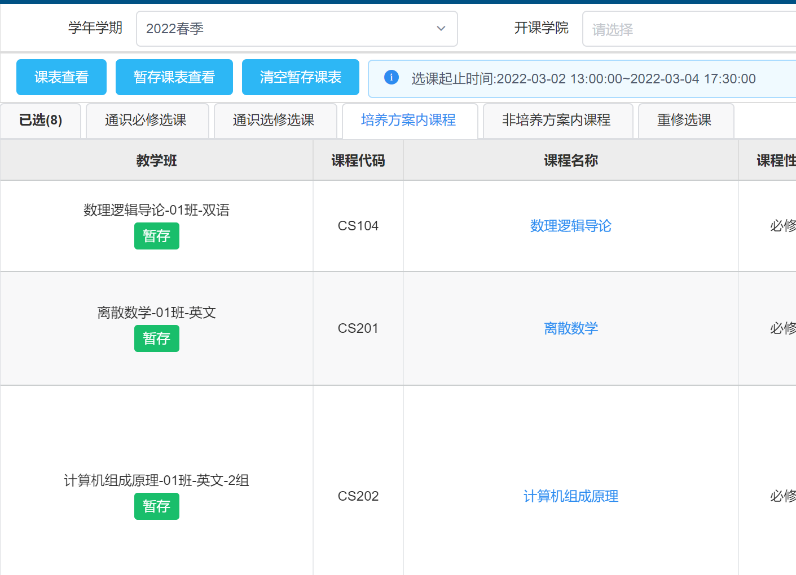
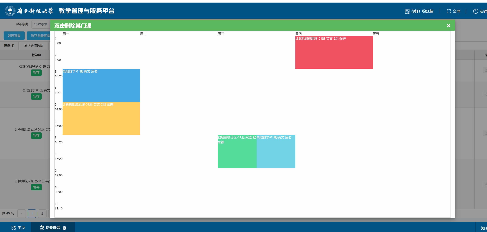

# SUSTech TIS Helper

一个能让南方科技大学的选课方便点的脚本。

为选课系统添加了暂存功能，可以直接将搜索出的课程忽略时间冲突暂存进一个单独的课程表中，以方便选择。

暂存的课程表在退出浏览器后会一直保存。

## 使用说明

该脚本可以通过脚本管理器（如Tampermonkey）安装或在浏览器内直接导入。

### 1. 通过脚本管理器安装  
把[SUSTechTISHelper.js](SUSTechTISHelper.js)添加进管理器就行。
### 2. 通过浏览器console导入  
打开tis和选课界面，在页面中**除标题栏和底栏的位置**右键-检查，选择上方的Console。

这里需要确保console标签下面一栏Filter左边没有top字样，然后将以下代码粘贴进console，回车即可。
   ``` js
      $(document.head).append('<script type="text/javascript" src="https://cdn.jsdelivr.net/gh/Fros1er/Timetable/Timetables.min.js">');
      $(document.head).append('<script type="text/javascript" src="https://cdn.jsdelivr.net/gh/Fros1er/SUSTechTISHelper/SUSTechTISHelper.min.js">');
      $(document.head).append('<link rel="stylesheet" href="https://cdn.jsdelivr.net/gh/Fros1er/SUSTechTISHelper/SUSTechTISHelper.min.css">');
   ```

导入后，可以在选课页的左侧看到多出来的几个按钮。

## 一些截图



## LICENSE
本项目由Apache-2.0协议开源，并使用由MIT协议开源的[Timetable](https://github.com/Hzy0913/Timetable)（虽然用的是自己fork的版本）